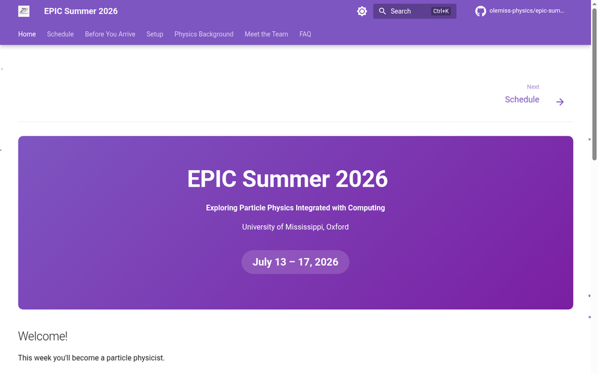

# EPIC Summer 2026 — Website

[](https://github.com/olemiss-physics/epic-summer-2026/actions/workflows/deploy.yml)
[](https://github.com/olemiss-physics/epic-summer-2026/releases/latest)
[](https://olemiss-physics.github.io/epic-summer-2026/)

Source for the EPIC Summer 2026 program website, built with [Zensical](https://zensical.org) (the successor to MkDocs Material, reading the same `mkdocs.yml` config).

**EPIC: Exploring Particle Physics Integrated with Computing**
University of Mississippi — July 13–17, 2026



## Local preview

Requires [`uv`](https://docs.astral.sh/uv/):

```bash
uv sync
uv run zensical serve
```

Open `http://localhost:8000/epic-summer-2026/` in your browser. The page live-reloads as you edit files — no need to restart.

```bash
uv run zensical build --strict   # build static site into site/ (optional, for inspection)
```

## Deploying to GitHub Pages

The site deploys to GitHub Pages on pushes to `main`, and can also be deployed manually from the Actions tab.

Either way, you'll also need to:
1. Make sure the repository lives at `olemiss-physics/epic-summer-2026`
2. In the repo Settings → Pages, set source to **GitHub Actions** (the deploy workflow uses `actions/deploy-pages`, not a `gh-pages` branch)
3. Push to `main` or run the "Deploy site to GitHub Pages" workflow manually

## Repository layout

```
docs/               # all site content (Markdown)
  index.md          # home page
  schedule.md       # day-by-day schedule
  before-you-arrive.md
  setup/            # environment setup guides
  notebooks/        # per-day notebook pages
  physics/          # background reading
  faq.md
mkdocs.yml          # site configuration (read natively by Zensical)
pyproject.toml      # Python dependencies
uv.lock             # locked dependency versions
.github/workflows/  # GitHub Actions deploy
```

## Notebooks

The Jupyter notebooks students use will live in a separate repository once the materials are finalized.
