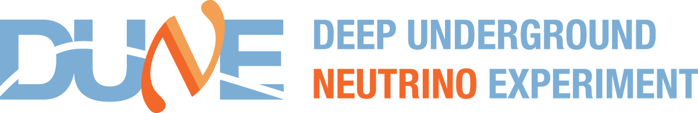
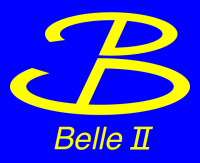

---
hide:
  - navigation
  - toc
---

# EPIC Summer 2026
**Exploring Particle Physics Integrated with Computing**

University of Mississippi, Oxford

July 13 – 17, 2026

## Welcome!

This week you'll become a particle physicist.

That might sound intimidating, but it's not — you already have everything you need. By Friday you'll have written real Python code to analyze real physics data, produced publication-quality plots, and presented your results to the group.

No prior coding experience required. No physics background assumed. Just curiosity.

---

## What you'll do this week

### :snake: Code in Python
Use Jupyter notebooks to load, explore, and plot real detector data — the same tools professional physicists use every day.

### :atom: Study two experiments
Investigate **neutrino oscillations** with NOvA, and **matter-antimatter asymmetry** with Belle II — two of the biggest open questions in physics.

### :bar_chart: Make real discoveries
By Friday you'll have your own histograms showing signals from real particle interactions, and you'll present them to the group.

---

## The experiments

  
  

---

## Your week at a glance

| Day | Focus |
|-----|-------|
| **Monday** | Welcome, tools setup, and the big picture |
| **Tuesday** | Neutrino oscillations — the disappearing particle |
| **Wednesday** | B mesons and the matter-antimatter mystery |
| **Thursday** | Deep dives, grad student talks, presentation prep |
| **Friday** | Student presentations and celebration |

[:calendar: See the full schedule](schedule.md){ .md-button .md-button--primary }
[:wrench: Get set up](setup/index.md){ .md-button }

---

## Before you arrive

Check out the [Before You Arrive](before-you-arrive.md) page for logistics, what to bring, and housing info.

!!! tip "First time here?"
    Start with **[Before You Arrive](before-you-arrive.md)**, then work through the **[Setup](setup/index.md)** guide so you're ready to go on Monday morning.

---

<small>EPIC Summer 2026 is supported by the U.S. Department of Energy EPSCoR Implementation Grant DE-SC0026215.</small>
