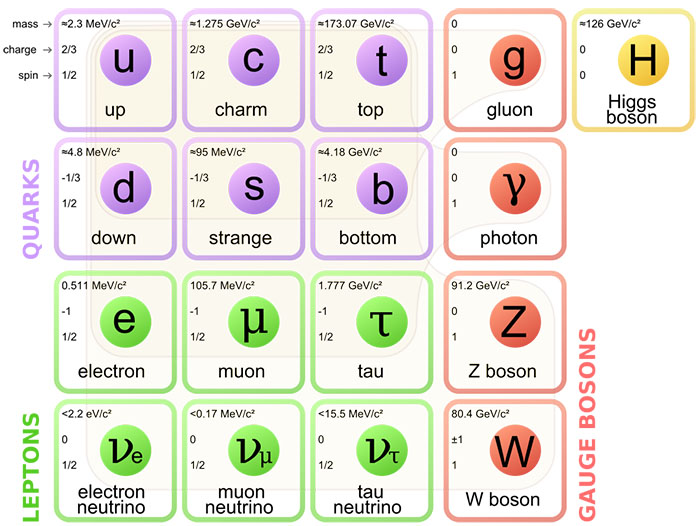
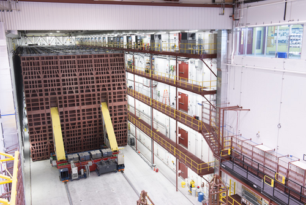
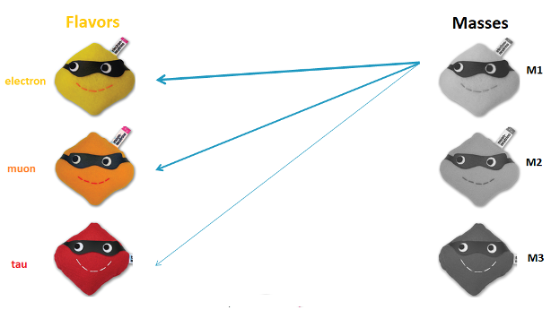

# Neutrinos

*Background reading for Day 2 — no prior physics knowledge assumed.*

---

## The ghost particle

A neutrino is passing through your body right now. Trillions of them, every second — mostly produced by nuclear reactions in the Sun. And you have absolutely no way of knowing.

That's because neutrinos are nearly massless and carry no electric charge. They don't feel electromagnetism (so they ignore magnetic fields and don't interact with electrons). They don't feel the strong nuclear force (which binds atomic nuclei together). The *only* force they respond to is the weak nuclear force — one of the feeblest forces in nature.

The result: a neutrino can pass through a light-year of solid lead and only have a 50% chance of interacting. Detecting them requires enormous detectors — and a lot of patience.

Intresting fact: A banana radiates about 1.2 million neutrino each seconds (radioactivity of Potassium).

---

## Three flavors

Neutrinos come in three varieties — called **flavors** — each associated with a different charged partner:

| Neutrino | Partner |
|----------|---------|
| Electron neutrino (νₑ) | Electron |
| Muon neutrino (νμ) | Muon |
| Tau neutrino (ντ) | Tau |

For most of the 20th century, physicists assumed these were distinct, fixed identities. Then came a surprise.

---

## History of Neutrinos

=== "The Birth of an Idea (1930–1939)"
    - 1930 – Wolfgang Pauli hypothesized a mysterious particle.
    - 1934 – Enrico Fermi named it “neutrino”.
    - 1935–1939 – Goeppert Mayer & Majorana predicted double beta decay (two neutrinos emitted) and suggested neutrinos could be their own antiparticles (Majorana particles).

=== "Catching the Ghost (1956–1968)"
    - 1956 – First detection by Reines & Cowan using a nuclear reactor.
    - 1957 – Bruno Pontecorvo predicted neutrino oscillations.
    - 1958 – Left-handed property discovered, a property by their spin.
    - 1962 – Muon Neutrino Discovered: Scientists discovered a second type of neutrino.
    - 1968 – Solar Neutrinos: Ray Davis detected neutrinos from the Sun, but found only 1/3 of expected, sparking the solar neutrino problem.

=== "Lab Discoveries (1973–2000)"
    - 1973 – Neutral currents at CERN showed the existence of a new force carrier, **Z boson**.
    - 1975 – Tau neutrino predicted, discovered in 2000.
    - 1985–1987 – Atmospheric & supernova neutrinos observed.
    - 1998 - Neutrino Oscillation confirmed, Super-Kamiokande proved neutrinos have mass.

=== "21st century: Csomic Messenger(2002-2020)"
    - 2002 – Solar Neutrino Mystery Solved: Sudbury Neutrino Observatory confirmed neutrinos change flavor on the way to Earth.
    - 2005 – Geoneutrinos Discovered: Neutrinos from Earth’s interior reveal hidden radioactive processes.
    - 2010–2015 – Neutrino Oscillations & OPERA: Muon neutrinos transform into tau neutrinos; oscillation discovery earns Nobel Prize.
    - 2012 – Big Bird Neutrino: IceCube detects the highest-energy neutrino ever.
    - 2017–2018 – Neutrinos Point to Cosmic Accelerators: IceCube traces a neutrino back to a blazar 4 billion light-years away, ushering in multimessenger astronomy.
    - 2020 – Sun’s Hidden Fusion Cycle: Borexino detects neutrinos from the CNO cycle, confirming a long-standing prediction about solar fusion.

---

## Oscillation: the shape-shifting particle

Neutrinos do not keep a fixed flavor as they travel. A neutrino that starts as a muon neutrino can later be detected as an electron neutrino or tau neutrino. This is called **neutrino oscillation**.

Oscillation happens because the flavor states we detect are mixtures of the mass states that travel through space. That matters because the original Standard Model assumed neutrinos were massless. The discovery of oscillations showed that neutrinos have mass, so the Standard Model cannot be the whole story.

For a beam of muon neutrinos, one useful question is: what fraction are still muon neutrinos after traveling a distance \(L\) with energy \(E\)? A simplified survival probability is:

$$P(\nu_\mu \to \nu_\mu) \approx 1 - \sin^2(2\theta_{23}) \cdot \sin^2\!\left(\frac{1.27 \cdot \Delta m^2_{32} \cdot L}{E}\right)$$

Don't worry about every symbol yet. The key idea is that the survival probability **dips** at certain energies. In the tutorials, that dip shows up as fewer muon-neutrino events in the far detector than we would expect without oscillation.

---

## Standard Model of Particle physics

The standard model of particle physics is scientists' current best theory to describe the most basic building block of universe. It explains how partices called **quarks** make up all known matter.

Although the Standard Model successfully explains many fundamental particles and interactions, it is not complete. The Higgs boson gives mass to quarks, charged leptons, and the W and Z bosons, but it does not explain the masses of neutrinos. Experiments have observed Neutrino Oscillation, where neutrinos change from one flavor to another as they travel. This process can only occur if neutrinos have mass, which the Standard Model does not account for, showing that the theory is incomplete. Additionally, most of the universe consists of Dark Matter and Dark Energy, which are also not explained by the Standard Model.

---

## NOvA: seeing the dip

NOvA (NuMI Off-axis νₑ Appearance) is a Fermilab experiment designed to measure neutrino oscillations with two detectors and one neutrino beam.

- A beam of muon neutrinos is produced at Fermilab, near Chicago
- The beam travels **810 km** underground to a detector in Ash River, Minnesota
- A smaller **near detector** at Fermilab measures the beam before oscillation has had much effect
- The large **far detector** in Minnesota measures it after significant oscillation has occurred
- By comparing the two detectors, physicists measure the oscillation pattern

The far detector is a 14,000-tonne block of plastic filled with liquid scintillator — it glows faintly when a rare neutrino interaction occurs.

{ width=250 }
{ width=250 }

---

## DUNE: the next generation

DUNE (Deep Underground Neutrino Experiment) will use the same basic near/far idea on a longer baseline. A neutrino beam from Fermilab will travel about **1,300 km** to a huge liquid-argon detector at Sanford Underground Research Facility in South Dakota.

That longer trip gives oscillations more room to develop. DUNE is designed to measure the oscillation pattern with high precision, compare neutrinos with antineutrinos, and search for CP violation in the neutrino sector — one possible clue to why the universe contains more matter than antimatter.

In this program, NOvA gives us the tutorial-scale example: make spectra, compare near and far detectors, and find the dip. DUNE shows where the field is going next.

---

## Flavour-eigenstate and Mass-eigenstate

Neutrino Exists in two different states, one is flavor-eigen state and another is mass eigen state.Neutrinos are observed in the three flavors that correspond to the leptons (electron, muon, and tau) that are produced when the neutrinos interact. 
    
In the simplest explanation for neutrino flavor change, the three neutrino flavors are quantum mechanical combinations of three neutrino mass states. This means that neutrinos travel as a combination of the three mass states rather than as a single, static flavor.

---

## Why does this matter?

Neutrino oscillation tells us the neutrinos have mass — but the Standard Model says they shouldn't. That's a crack in our best theory of nature.

Neutrinos might also hold a clue to why the universe is made of matter rather than equal amounts of matter and antimatter. Experiments like NOvA and DUNE search for differences between neutrino and antineutrino oscillations. If those differences are real, they would point to new physics beyond the Standard Model.

---

## Histograms in Neutrino Oscillation

Basically, most common histogram used in NOvA experiment can be categorized into following three types: 

- Energy Specturm
- PID Score
- Vertex Distribution
- L/E Distribution

### Energy Spectrum: 
This is the most famous histogram in NOvA. It shows how much energy the neutrinos have when they hit the detector.

- The X-Axis: Neutrino Energy (measured in GeV).
- The Y-Axis: Number of Neutrinos detected.

In the Near Detector (at Fermilab), we see a tall, smooth mountain of muon neutrinos. But in the Far Detector (810 km away), that mountain has a huge "dip" or "bite" taken out of it. That missing "bite" is the proof of neutrino oscillation. The neutrinos didn't disappear; they changed flavor!

### PID Spectrum: 
PID stands for Particle Identification. NOvA uses a "CVN" (Convolutional Visual Network)—basically a fancy AI—to look at pictures of particle tracks and guess what they are.

- The X-Axis: Probability Score (from 0 to 1).
- The Y-Axis: Number of Events.

If the AI is 90% sure an event is an electron neutrino, it puts a count in the 0.9 bin. If it's only 10% sure, it goes in the 0.1 bin.
To be safe, scientists might say: "We only trust events with a score higher than 0.8." This is a selection cut. It removes the "fakes" and keeps the real signal.

### Vertex Spectrum:
A "vertex" is the exact point where a neutrino hit an atom and exploded into other particles.

- The X/Y/Z-Axis: The physical location inside the detector.
- The Y-Axis: Density of interactions.

We expect neutrinos to hit the detector evenly. If we see a huge "spike" of events near the edges of the detector, those aren't neutrinos—those are Cosmic Rays (background noise) leaking in from the outside.

We use a fiducial volume cut. We basically draw an invisible box inside the detector and "cut" any data that happened too close to the walls.

### L/E Specturm: 
In NOvA, the L/E spectrum tells us exactly "how much" the neutrinos weigh because the position of that dip in the histogram is directly tied to the neutrino's mass ($\Delta m^2$).
By binning data according to the ratio of distance to energy, we map out the quantum mechanical probability wave of the neutrino. The "dip" in the histogram is the physical manifestation of the $\sin^2$ term in the oscillation formula, providing direct evidence of the mass-squared difference between neutrino states.
This can be infered from the fomula below:

$$P(\nu_\mu \rightarrow \nu_\mu) \approx 1 - \sin^2(2\theta_{23}) \sin^2 \left( 1.27 \frac{\Delta m_{32}^2 \cdot L}{E} \right)$$

*Ready to see the data? We'll work through the neutrino tutorial together during the program.*
