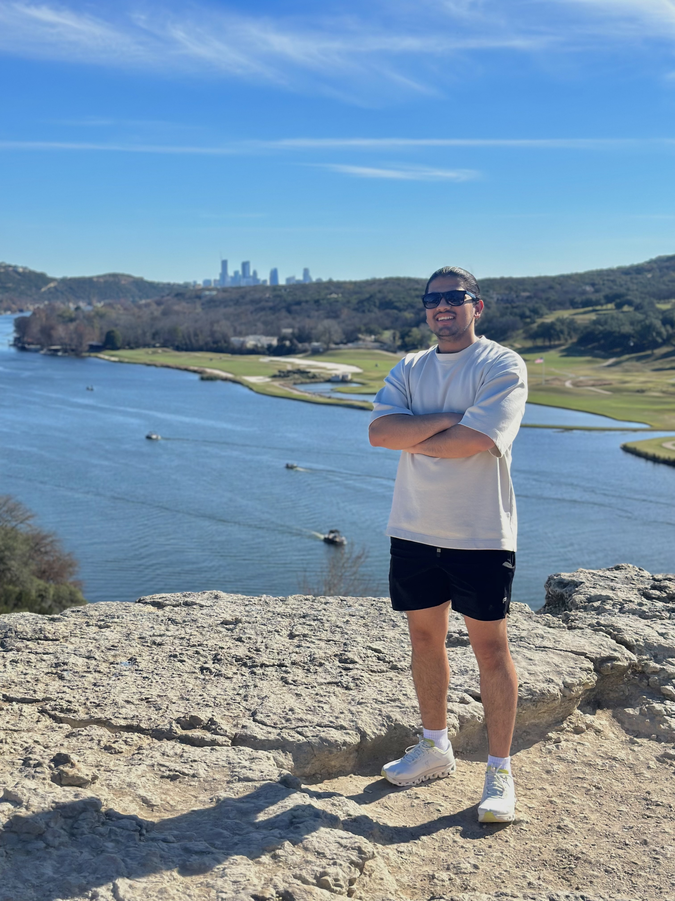

# Meet the Team

### Dr. Gavin S. Davies
**Associate Professor, Physics & Astronomy**

Gavin works on the [DUNE](https://www.dunescience.org) experiment, studying three-flavour neutrino oscillations and searching for non-standard neutrino interactions.

### Dr. Jake V. Bennett
**Associate Professor, Physics & Astronomy**

Jake works on the [Belle II](https://www.belle2.org) experiment at the SuperKEKB collider in Japan, measuring CP violation in charmed baryon decays and probing the matter-antimatter asymmetry of the universe.

### Suyog Badal
**Undergraduate Student Helper**

Suyog is an undergraduate physics student working on neutrino oscillation analysis with the NOvA experiment. He helps support participants, coordinate logistics, and assist with daily analysis sessions.

### Prof. Jeremy Scott
**Associate Teaching Professor, University of Southern Mississippi**

Jeremy teaches physics at the University of Southern Mississippi. His areas of expertise include particle physics, nuclear physics, scattering, high-energy physics, and relativity.

### Prof. Breese Quinn
**Professor, Physics & Astronomy**

Breese works on the [Muon g-2](https://muon-g-2.fnal.gov) experiment, precisely measuring the muon's magnetic moment to search for physics beyond the Standard Model, and has recently joined the [DUNE](https://www.dunescience.org) collaboration.

### Dr. Daniel Souza Correia
**Postdoctoral Research Associate, Physics & Astronomy**

Daniel is a postdoc working on [DUNE](https://www.dunescience.org) data management, helping build the software infrastructure that moves and organizes experiment data. He helps support participants throughout the week.

### Dr. Johan A. Colorado Caicedo
**Postdoctoral Research Associate, Physics & Astronomy**

Johan is a postdoc working on [Belle II](https://www.belle2.org) data management, helping build the software infrastructure that moves and organizes experiment data. He helps support participants throughout the week.

### Logan Benninghoff
**PhD Researcher, Belle II**

Logan is a graduate student working on the [Belle II](https://www.belle2.org) experiment. He leads the Unix command-line tutorial and helps mentor teams through their project work.

### Paul Gebeline
**PhD Researcher, Belle II**

Paul is a graduate student working on the [Belle II](https://www.belle2.org) experiment. He leads the Python tutorial and helps mentor teams through their project work.

### *Guest Speaker TBD*
**Invited Researcher**

We will host guest speakers from the broader DUNE and Belle II collaborations to talk about life as a physicist.

